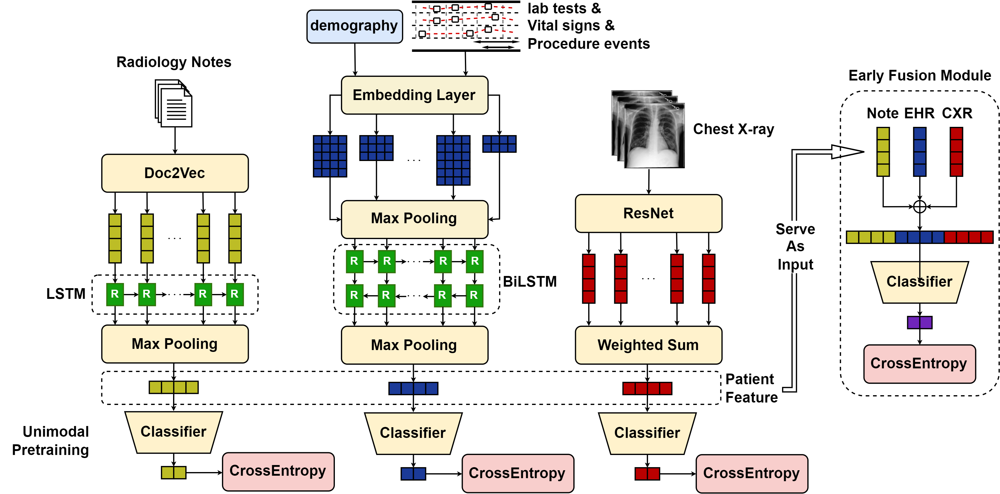
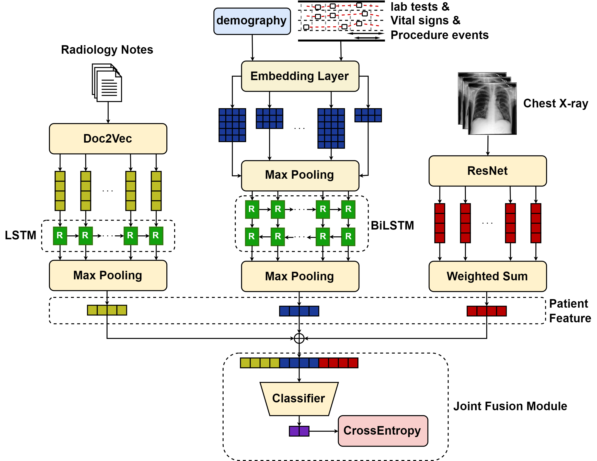
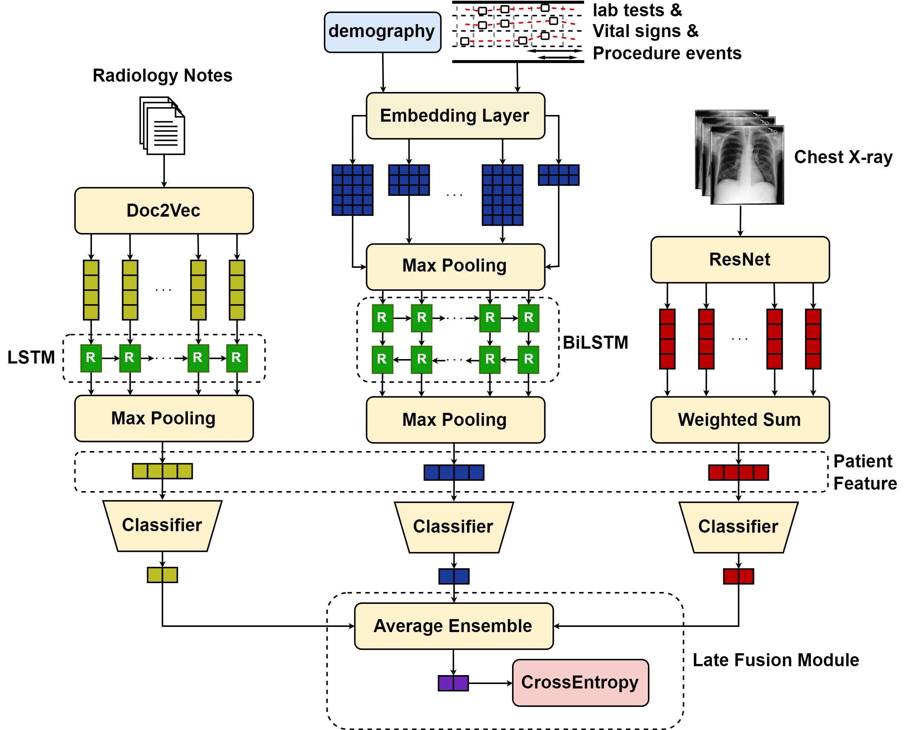

# Multimodal Risk Prediction with Physiological Signals, Medical Images and Clinical Notes

This repository contains the official PyTorch implementation of the following paper:

> **Multimodal Risk Prediction with Physiological Signals, Medical Images and Clinical Notes**
> 
> Yuanlong Wang, Changchang Yin, Ping Zhang
>
> **Abstract**: The broad adoption of electronic health records (EHRs) provides great opportunities to conduct healthcare research and solve various clinical problems in medicine. With recent advances and success, methods based on machine learning and deep learning have become increasingly popular in medical informatics. Combining data from multiple modalities may help in predictive tasks. To assess the expectations of multimodal data, we introduce a comprehensive fusion framework designed to integrate temporal variables, medical images, and clinical notes in  Electronic Health Record (EHR) for enhanced performance in downstream predictive tasks. Early, joint, and late fusion strategies were employed to effectively combine data from various modalities. Model performance and contribution scores show that multimodal models outperform uni-modal models in various tasks. Additionally, temporal signs contain more information than CXR images and clinical notes in three explored predictive tasks. Therefore, models integrating different data modalities can work better in predictive tasks.
>

## Framework

There are three fusion methods implemented: early fusion, joint fusion, and late fusion.

Early fusion trains feature extractors and the classifier separately. Feature extractors are pretrained on the target task and fixed during training the classifier, as the figure below showed.



Joint fusion have similar structure as early fusion, where features from various modalities are concatenated together and send to the classifier. However, the model is trained end-to-end. 



Late fusion employs classifiers on each modality respectively and take the average of the predictions from all modalities as the final prediction.



## Files directory
```
./
├─corpus    # empty folder for output
├─utils     # helper files
├─dataset
│  │  cxr_dataset.py
│  │  ehr_dataset.py
│  │  embed_dataset.py
│  │  mul_dataset.py
│  └─ note_dataset.py
├─imgs
│  │  early_fusion.png
│  │  joint_fusion.png
│  └─ late_fusion.png
├─models
│  |  mul_module.py
│  |  note_module.py
│  │  cxr_module.py
│  └─ ehr_module.py
│  ehr_train_partial.py
│  cxr_train_partial.py
│  note_train_partial.py
│  doc2vec_train.py
│  generate_embeddings.py
│  multimodal_train.py      # main script for multimodal model training 
│  MIMIC_IV_HAIM_API.py
│  1_Generate HAIM-MIMIC-MM from downloaded MIMIC-IV and MIMIC-CXR.py
└─ README.md
```
## Requirements
```
Python 3.7
PyTorch 1.13.1
pandas 1.3.5
scikit-learn 1.0.2
gensim
```
## Code Usage

1. Download MIMIC-IV, MIMIC-CXR, MIMIC-IV-Note from [PhysioNet](https://physionet.org/), credential access needed. put them in the data folder with this structure:
    ```
    ./data
    |   mimiciv/*
    |   mimic-cxr-jpg/*
    |   mimic-note/*
    ```
2. run `1_Generate HAIM-MIMIC-MM from downloaded MIMIC-IV and MIMIC-CXR.py`
3. run `doc2vec_train.py`
4. select the model you want to train and run the corresponding script
   - for unimodal ones, run `*_train_partial.py` where `*` denotes the modality you want to use
   - for multimodal ones, use command like
        ```
        python multimodal_train.py -m <modality_combination> --mode <fusion_strategy> -e <num_of_epoch> -t <task> -r
        ```
        where `<modality_combination>` should be one of `ecn`, `ec`, `en`, `cn`, which defines the modality used as input.
        `<fusion_strategy>` should be one of `early`, `joint`, `late`

<p>
<text style='color:red'>Note: *_partial_train.py must be run before train early fusion models for any task</text>
</p>
